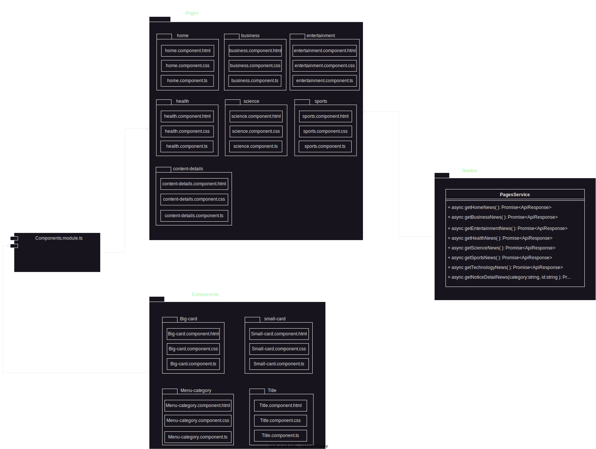

# BlogNews
This project was generated with [Angular CLI](https://github.com/angular/angular-cli) version 17.0.7.

<a href="">Clique aqui para acessar o site desse projeto</a>

## Tecnologias
1. Angular
2. HTML
3. CSS
4. TypeScript
5. Node.js 

## Futuras funcionalidades
- desenvolver um filtro para buscar uma notícia específica em uma página
- criar modo escuro-claro
- melhorar o menu de categorias para se tornar mais dinâmico
- criar a responsividade para larguras de telas maiores, como as de desktop e tvs
  

## Resumo
Nesse projeto a idea foi de desenvolver uma aplicação angular que consiga ser um blog de notícias funcional, que exiba as notícias mais recentes e populares de cada categoria. Para isso eu usei a <a href="https://servicodados.ibge.gov.br/api/docs/noticias?versao=3">Api de notícias do IBGE<a>, essa api fornece algumas informações sobre várias notícias para algumas categorias que eles disponibilizam, que são `gerais`, `sociais`, `geociências`, `economia`.

Essa Api e outras que pesquisei não disponibilizam o contéudo completo da notícia por conta de direitos autorais dos criadores da matérias, mas eles disponibilizam o link original da notícia e por conta disso eu so tive acesso a breves descrições e uma pequena parte do conteúdo completo, o que por consequencia não me permitiu criar uma página de detalhes.

## Estrutura
A estrutura de forma geral é simples, o app é composto de 3 principais pilares, que são: `components`,`pages` e `services`. 

`components` são as menores estruturas que seráo injetadas nas páginas da aplicação, cada página usa os componentes criados em uma sequência e estilo bem parecidos, porém, com conteúdos diferentes.

`dos environments` se refere as variáveis que eu constantemente irei usar durante toda a aplicação, como por exemplo: urls da api, chave da api e outros

`types.ts` que é o que define os tipos das informações que irão chegar da api e os tipos para alguns objetos específicos, fazer essa tipagem me ajuda a ter mais previsibilidade dos dados que estão chegando, criando uma melhor estabilidade para processar essas informações com menos chances de dar algum erro em tempo de execução, e se tiver, terá em tempo de desenvolvimento

`GlobalFunctions.ts` essas funções são usadas em todas as páginas da minha aplicação, por isso, encapsulei a lógica dessas funções em um único local para que elas possam ser reaproveitadas. Toda classe que herde de `GlobalFunctions` poderá usar esses métodos

`sharedService` esse serivço disponibiliza uma interface para que outros componentes possam acessar outros componentes de maneira mais simples e enviarem dados uns para os outros.

`pageService` esse serviço é responsável por se conectar com a API do IBGE e resgatar as noticias e enviar para todas as páginas que possuem esse serviço injetado

## Como acessar o Projeto via Angular
- primeiro faça o `git clone` para baixar o repositório completo na sua máquina ou baixe via <b>zip</b> e descompacte na sua pasta desejada
  
- para ir para o próximo passo será necessário ter instalado o <b><a href="https://nodejs.org/en">node.js</a></b> com ele teremos o gerenciador de dependẽncias <b>npm</b>, com ele será possível instalar o CLI do angular

- depois será preciso baixar o <b><a href="https://angular.io/guide/setup-local#install-the-angular-cli">angular CLI</a></b>,com ele será possível executar alguns comandos necessários para rodar esse projeto angular localmente 

- dentro da pasta deste projeto rode no terminal `ng serve` para abrir um servidor local de desenvolvimento, navegue até a url `http://localhost:4200/`. A aplicação será automaticamente recarregada se vocẽ fizer alguma alteração, com isso será possível ver todo o código da aplicação

- para obter mais informações em como usar o <b>angular CLI</b> use o `ng help` no terminal integrado e vocẽ verá várias opções de comandos e suas descrições. ou então vá para [Angular CLI Overview and Command Reference](https://angular.io/cli).

